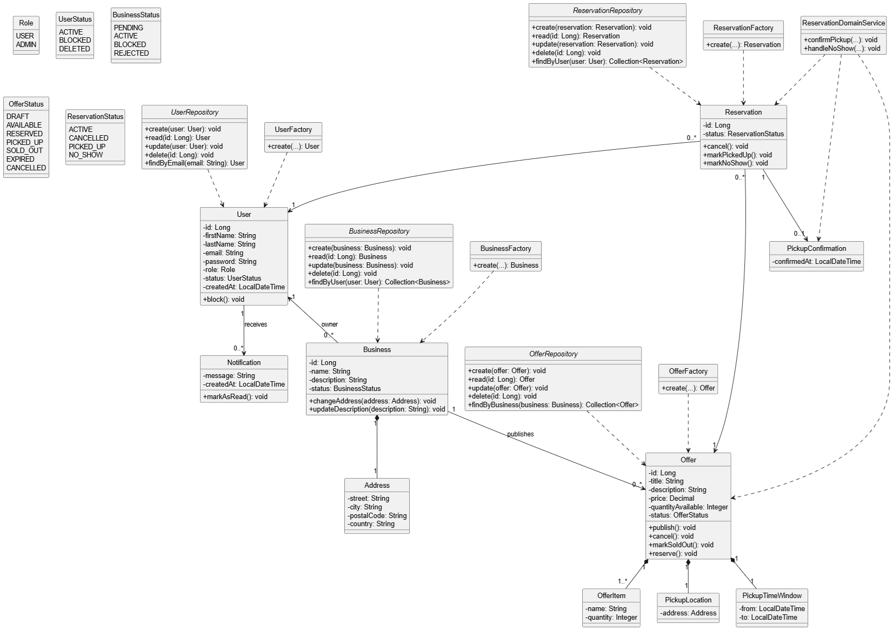

# Názov témy

**Savr Platform**

## Stručný popis témy

Savr Platform je informačný systém zameraný na znižovanie plytvania potravinami prostredníctvom evidencie, publikovania, vyhľadávania a rezervácie prebytočných potravín z reštaurácií, kaviarní a obchodov. Registrovaní používatelia môžu vyhľadávať dostupné ponuky, rezervovať ich a sledovať stav svojich rezervácií. Používateľ môže zároveň vytvoriť a spravovať jednu alebo viac prevádzok, prostredníctvom ktorých publikuje ponuky potravín určených na vyzdvihnutie v definovanom čase a na definovanom mieste. Systém zároveň zabezpečuje správu životného cyklu ponúk a rezervácií, notifikácie o dôležitých zmenách a základnú administráciu používateľov a obsahu.

## Zoznam požiadaviek

| ID | Požiadavka |
|----|------------|
| RQ01 | Systém umožní registráciu používateľa do systému. |
| RQ02 | Systém umožní prihlásenie používateľa do systému. |
| RQ03 | Systém umožní používateľovi vytvoriť prevádzku (`Business`). |
| RQ04 | Systém umožní administrátorovi schváliť alebo zamietnuť prevádzku. |
| RQ05 | Systém umožní prevádzke vytvoriť a zverejniť ponuku prebytočných potravín. |
| RQ06 | Systém umožní prevádzke upraviť vlastnú ponuku. |
| RQ07 | Systém umožní prevádzke zrušiť vlastnú ponuku. |
| RQ08 | Systém umožní používateľovi vyhľadávať dostupné ponuky. |
| RQ09 | Systém umožní používateľovi rezervovať dostupnú ponuku. |
| RQ10 | Systém umožní používateľovi zrušiť rezerváciu pred koncom času vyzdvihnutia. |
| RQ11 | Systém bude evidovať miesto a čas vyzdvihnutia ku každej ponuke. |
| RQ12 | Systém umožní prevádzke potvrdiť vyzdvihnutie rezervovanej ponuky. |
| RQ13 | Systém umožní používateľovi zobraziť históriu rezervácií. |
| RQ14 | Systém upozorní používateľa na zmenu stavu rezervácie, ponuky alebo prevádzky. |
| RQ15 | Systém umožní prevádzke označiť ponuku ako vypredanú alebo nedostupnú. |
| RQ16 | Systém umožní administrátorovi spravovať používateľov. |
| RQ17 | Systém umožní administrátorovi spravovať prevádzky a ponuky. |
| RQ18 | Systém umožní administrátorovi zablokovať používateľa. |

---

## Slovník pojmov

| **Pojem** | **Anglický názov** | **Definícia** |
|-----------|--------------------|---------------|
| **Používateľ** | User | Registrovaný používateľ systému, ktorý môže vyhľadávať a rezervovať ponuky. Zároveň môže vytvoriť a spravovať prevádzky. |
| **Prevádzka** | Business | Subjekt reprezentujúci reštauráciu, obchod alebo kaviareň. Vždy patrí konkrétnemu používateľovi a nemôže existovať samostatne. |
| **Stav prevádzky** | BusinessStatus | Stav prevádzky (`PENDING`, `ACTIVE`, `BLOCKED`, `REJECTED`). |
| **Administrátor** | Administrator | Používateľ s oprávneniami na správu systému. |
| **Rola** | Role | Typ oprávnenia (`USER`, `ADMIN`). |
| **Stav používateľa** | UserStatus | Stav používateľa (`ACTIVE`, `BLOCKED`, `DELETED`). |
| **Adresa** | Address | Hodnotový objekt reprezentujúci adresu. |
| **Ponuka** | Offer | Záznam o dostupných potravinách na rezerváciu. |
| **Položka ponuky** | OfferItem | Jednotlivá položka ponuky. |
| **Stav ponuky** | OfferStatus | Stav ponuky v systéme. Nadobúda hodnoty `DRAFT`, `AVAILABLE`, `RESERVED`, `PICKED_UP`, `SOLD_OUT`, `EXPIRED`, `CANCELLED`. |
| **Rezervácia** | Reservation | Záznam o rezervovaní ponuky používateľom. |
| **Stav rezervácie** | ReservationStatus | Stav rezervácie v systéme. Nadobúda hodnoty `ACTIVE`, `CANCELLED`, `PICKED_UP`, `NO_SHOW`. |
| **Miesto vyzdvihnutia** | PickupLocation | Miesto vyzdvihnutia ponuky (môže sa líšiť od adresy prevádzky). |
| **Čas vyzdvihnutia** | PickupTimeWindow | Časový interval vyzdvihnutia. |
| **Potvrdenie vyzdvihnutia** | PickupConfirmation | Potvrdenie úspešného vyzdvihnutia. |
| **Notifikácia** | Notification | Správa doručená používateľovi pri zmene stavu ponuky, rezervácie alebo prevádzky. |

---

## Zoznam prípadov použitia

- UC-01 Registrácia používateľa  
- UC-02 Prihlásenie používateľa  
- UC-03 Vytvorenie prevádzky  
- UC-04 Schválenie prevádzky  
- UC-05 Vytvorenie ponuky  
- UC-06 Úprava ponuky  
- UC-07 Zrušenie ponuky  
- UC-08 Vyhľadávanie ponúk  
- UC-09 Rezervácia ponuky  
- UC-10 Zrušenie rezervácie  
- UC-11 Potvrdenie vyzdvihnutia  
- UC-12 História rezervácií  
- UC-13 Notifikácie  
- UC-14 Označenie ako vypredané  
- UC-15 Správa používateľov
- UC-16 Správa prevádzok a ponúk
- UC-17 Zablokovanie používateľa

---

## Detailne rozpracované prípady použitia

### UC-03-001 Vytvorenie prevádzky

#### Účel
Vytvoriť novú prevádzku, prostredníctvom ktorej bude môcť používateľ po schválení publikovať ponuky prebytočných potravín.

#### Používateľ
Používateľ.

#### Vstupné podmienky
Používateľ je prihlásený do systému a má aktívny účet.

#### Výstup
V systéme pribudla nová prevádzka priradená danému používateľovi. Prevádzka má stav `PENDING`.

#### Postup
1. Používateľ otvorí formulár na vytvorenie prevádzky.
2. Systém zobrazí formulár na zadanie údajov o prevádzke.
3. Používateľ zadá názov prevádzky, popis a adresu prevádzky.
4. Používateľ zvolí uloženie prevádzky.
5. Systém overí povinné údaje a správnosť zadaných hodnôt.
6. Systém vytvorí novú prevádzku, priradí ju prihlásenému používateľovi a nastaví jej stav `PENDING`.
7. Systém zobrazí potvrdenie o úspešnom vytvorení prevádzky.
8. Systém informuje používateľa, že prevádzka musí byť schválená administrátorom pred publikovaním ponúk.

#### Alternatívy

- `1a.` Používateľ nie je prihlásený do systému.
  - `1a1.` Systém nepovolí vytvorenie prevádzky.
  - `1a2.` Systém vyžiada prihlásenie používateľa.

- `5a.` Používateľ nevyplní povinný údaj.
  - `5a1.` Systém informuje používateľa o chýbajúcich povinných údajoch.
  - `5a2.` Systém nepovolí vytvorenie prevádzky.

- `5b.` Používateľ zadá neplatné údaje adresy.
  - `5b1.` Systém informuje používateľa o nesprávne zadaných údajoch adresy.
  - `5b2.` Systém vyžiada opravu údajov.

- `5c.` Používateľ už má prevádzku s rovnakým názvom.
  - `5c1.` Systém informuje používateľa, že prevádzka s daným názvom už existuje.
  - `5c2.` Systém nepovolí vytvorenie prevádzky.

---

### UC-05-001 Vytvorenie a zverejnenie ponuky

#### Účel
Vytvoriť a zverejniť novú ponuku prebytočných potravín patriacu do konkrétnej prevádzky.

#### Používateľ
Používateľ – vlastník prevádzky.

#### Vstupné podmienky
Používateľ je prihlásený do systému. Používateľ vlastní konkrétnu prevádzku a táto prevádzka má stav `ACTIVE`.

#### Výstup
V systéme pribudla nová ponuka v stave `AVAILABLE`, priradená ku konkrétnej prevádzke a viditeľná vo vyhľadávaní.

#### Postup
1. Používateľ otvorí detail svojej prevádzky.
2. Systém zobrazí údaje o prevádzke a dostupné akcie.
3. Používateľ zvolí možnosť vytvoriť novú ponuku.
4. Systém zobrazí formulár na zadanie údajov o ponuke.
5. Používateľ zadá názov ponuky, popis, položky ponuky, miesto vyzdvihnutia a časové okno vyzdvihnutia.
6. Používateľ zvolí uloženie ponuky.
7. Systém overí povinné údaje, platnosť časového okna a správnosť zadaného miesta vyzdvihnutia.
8. Systém vytvorí novú ponuku v stave `AVAILABLE` a priradí ju danej prevádzke.
9. Systém zobrazí potvrdenie o úspešnom vytvorení ponuky.
10. Systém zaradí ponuku medzi dostupné ponuky vo vyhľadávaní.

#### Alternatívy

- `1a.` Používateľ sa pokúsi vytvoriť ponuku pre prevádzku, ktorú nevlastní.
  - `1a1.` Systém akciu zamietne z dôvodu nedostatočných oprávnení.

- `3a.` Prevádzka používateľa nie je v stave `ACTIVE`.
  - `3a1.` Systém nepovolí vytvorenie ponuky.
  - `3a2.` Systém informuje používateľa, že prevádzka ešte nebola schválená alebo je blokovaná.

- `5a.` Používateľ nevyplní povinné údaje ponuky.
  - `5a1.` Systém vypíše validačné chyby.
  - `5a2.` Systém nepovolí uloženie ponuky.

- `7a.` Čas vyzdvihnutia je neplatný.
  - `7a1.` Systém informuje používateľa o neplatnom časovom intervale.
  - `7a2.` Systém vyžiada opravu údajov.

- `7b.` Miesto vyzdvihnutia nie je zadané správne.
  - `7b1.` Systém informuje používateľa o nesprávnych údajoch miesta vyzdvihnutia.
  - `7b2.` Systém vyžiada opravu údajov.

---

### UC-09-001 Rezervácia ponuky

#### Účel
Rezervovať dostupnú ponuku prebytočných potravín na vyzdvihnutie.

#### Používateľ
Používateľ.

#### Vstupné podmienky
Používateľ je prihlásený do systému. Vybraná ponuka existuje a je v stave `AVAILABLE`.

#### Výstup
V systéme pribudla nová rezervácia v stave `ACTIVE`. Stav ponuky sa zmenil na `RESERVED`. Používateľ a vlastník prevádzky boli informovaní o zmene stavu.

#### Postup
1. Používateľ vyhľadá dostupné ponuky.
2. Systém zobrazí zoznam dostupných ponúk.
3. Používateľ zvolí konkrétnu ponuku.
4. Systém zobrazí detail ponuky vrátane položiek, miesta vyzdvihnutia a času vyzdvihnutia.
5. Používateľ zvolí možnosť rezervovať ponuku.
6. Systém overí, že ponuka je stále dostupná.
7. Systém vytvorí rezerváciu v stave `ACTIVE` a priradí ju danému používateľovi a danej ponuke.
8. Systém zmení stav ponuky na `RESERVED`.
9. Systém zobrazí používateľovi potvrdenie o úspešnej rezervácii.
10. Systém odošle notifikáciu používateľovi a vlastníkovi prevádzky.

#### Alternatívy
- `1a.` Používateľ nie je prihlásený do systému.
  - `1a1.` Systém nepovolí vytvorenie rezervácie.
  - `1a2.` Systém vyžiada prihlásenie používateľa.

- `6a.` Ponuka už nie je dostupná.
  - `6a1.` Systém rezerváciu nevytvorí.
  - `6a2.` Systém zobrazí používateľovi informáciu o nedostupnosti ponuky.

- `8a.` Systém zistí konflikt stavu ponuky pri ukladaní rezervácie.
  - `8a1.` Systém rezerváciu nevytvorí.
  - `8a2.` Systém obnoví detail ponuky a zobrazí aktuálny stav.

- `10a.` Notifikáciu vlastníkovi prevádzky nie je možné doručiť.
  - `10a1.` Systém uloží rezerváciu aj napriek tomu.
  - `10a2.` Systém zaznamená neúspešné doručenie notifikácie.

## UML Diagram

## Obchodné pravidlá (Business Rules)

1. Používateľ sa musí prihlásiť do systému, aby mohol vytvárať prevádzky, ponuky alebo rezervácie.
2. Používateľ môže vytvoriť a spravovať nula alebo viac prevádzok (`Business`).
3. Každá prevádzka patrí presne jednému používateľovi a nemôže existovať bez vlastníka.
4. Novovytvorená prevádzka má stav `PENDING` a musí byť schválená administrátorom.
5. Prevádzka v stave `PENDING`, `BLOCKED` alebo `REJECTED` nemôže publikovať ponuky.
6. Ponuku je možné vytvoriť iba pre prevádzku v stave `ACTIVE`.
7. Ponuka obsahuje aspoň jednu položku (`OfferItem`).
8. Každá ponuka má presne jedno miesto vyzdvihnutia (`PickupLocation`) a jedno časové okno (`PickupTimeWindow`).
9. Časové okno vyzdvihnutia musí spĺňať podmienku `from < to`.
10. Miesto vyzdvihnutia sa môže, ale nemusí zhodovať s adresou prevádzky.
11. Ponuku je možné rezervovať iba v stave `AVAILABLE`.
12. Jedna rezervácia sa viaže presne na jednu ponuku a jedného používateľa.
13. Stav ponuky `RESERVED` znamená, že ponuka už nie je dostupná na ďalšiu rezerváciu.
14. Rezerváciu je možné zrušiť iba pred uplynutím času vyzdvihnutia (`PickupTimeWindow`).
15. Ak používateľ nevyzdvihne ponuku v stanovenom čase, rezervácia môže prejsť do stavu `NO_SHOW`.
16. Pri potvrdení vyzdvihnutia musí vzniknúť záznam `PickupConfirmation`.
17. Používateľ môže vykonávať operácie iba nad svojimi prevádzkami a rezerváciami.
18. Administrátor môže spravovať všetkých používateľov, prevádzky a ponuky.
19. Administrátor môže meniť stav prevádzky (`BusinessStatus`).
20. Používateľ so stavom `BLOCKED` nemôže vykonávať nové akcie v systéme.
21. Zmena stavu ponuky, rezervácie alebo prevádzky môže vyvolať vytvorenie notifikácie.
22. Používateľ nemôže vytvoriť dve prevádzky s rovnakým názvom.

